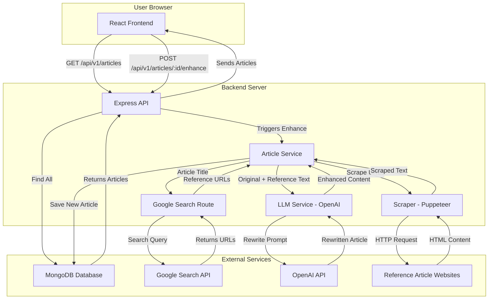

# Article Scraper and LLM Summarizer

This is a full-stack web application that scrapes articles, enhances them with AI using reference articles from the web, and displays both the original and AI-enhanced versions.

## Features

- **Article Enhancement:** Automatically enriches original articles by finding relevant content on the web and using an LLM to create a more comprehensive version.
- **Content Scraping:** Uses Puppeteer to scrape content from reference article URLs.
- **AI-Powered Rewriting:** Leverages the OpenAI API (GPT-4.1-mini) to rewrite and enhance articles based on scraped content.
- **Reference Sourcing:** Utilizes the Google Custom Search API to find relevant articles to use as references.
- **Comparison UI:** A simple, clean React interface to view and compare the original and AI-enhanced articles.

## Architecture & Data Flow

The application is composed of a React frontend, a Node.js/Express backend, and a MongoDB database. The enhancement process is initiated via an API call and involves several steps, from searching for reference materials to scraping and rewriting content with an LLM.



## Tech Stack

- **Frontend:** React, Vite, Tailwind CSS, Axios
- **Backend:** Node.js, Express.js
- **Database:** MongoDB
- **Core Services:**
  - **Puppeteer:** For web scraping.
  - **OpenAI API:** For content generation and enhancement.
  - **Google Custom Search API:** For finding reference articles.

## Local Setup

### Prerequisites

- [Node.js](https://nodejs.org/) (v20.x or higher recommended)
- [npm](https://www.npmjs.com/)
- [MongoDB](https://www.mongodb.com/try/download/community) instance (local or cloud)
- [Git](https://git-scm.com/)

---

### Backend Setup

1.  **Clone the repository:**
    ```bash
    git clone <your-repo-url>
    cd <repo-folder>
    ```

2.  **Navigate to the backend directory:**
    ```bash
    cd backend
    ```

3.  **Install dependencies:**
    ```bash
    npm install
    ```

4.  **Create an environment file:**
    Create a `.env` file in the `backend` directory and add the following variables:

    ```env
    # Server Configuration
    PORT=5000

    # MongoDB Connection
    MONGO_URI=<your_mongodb_connection_string>

    # OpenAI API Key
    OPENAI_API_KEY=<your_openai_api_key>

    # Google Custom Search API Credentials
    GOOGLE_SEARCH_API=<your_google_search_api_key>
    SEARCH_ENGINE_ID=<your_search_engine_id>
    ```
    *Note: The frontend and the backend's own service currently expect the backend to run on port `5000`.*

5.  **Run the backend server:**
    ```bash
    npm run dev
    ```
    The backend server will be running on `http://localhost:5000`.

---

### Frontend Setup

1.  **Navigate to the frontend directory** from the project root:
    ```bash
    cd frontend
    ```

2.  **Install dependencies:**
    ```bash
    npm install
    ```

3.  **Run the frontend development server:**
    ```bash
    npm run dev
    ```

4.  **Access the application:**
    Open your browser and go to `http://localhost:5173` (or the port specified by Vite).

## API Endpoints

The backend exposes the following REST API endpoints under the `/api/v1` prefix:

-   `GET /articles`: Fetches all articles.
-   `GET /articles/:id`: Fetches a single article by its ID.
-   `POST /articles`: Creates a new article.
-   `PUT /articles/:id`: Updates an existing article.
-   `DELETE /articles/:id`: Deletes an article.
-   `POST /articles/:id/enhance`: Triggers the AI enhancement process for a specific article.
-   `GET /google-article-search?title=<article_title>`: Searches for reference articles using the Google Custom Search API.

## Live Link

[Link to your deployed frontend application will go here]
